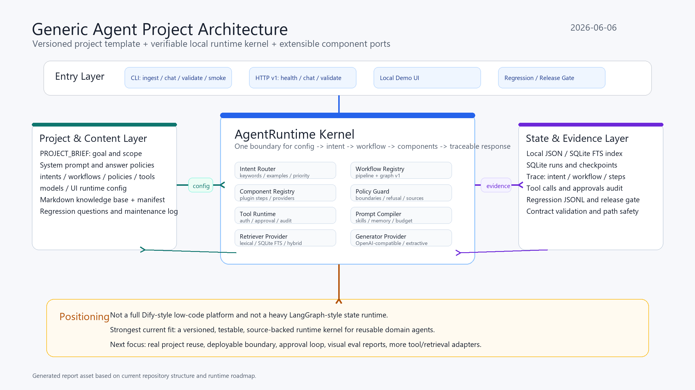

# 通用智能体项目阶段报告

日期：2026-06-06

当前分支：`codex/agent-runtime-contract-slices`

当前定位：可版本化、可验证、可迁移的通用智能体运行时内核，而不是完整低代码平台。

## 报告读者与用途

这份报告面向项目汇报、阶段评审和后续研发决策。读者读完后应能判断三件事：

1. 项目现在已经做到什么程度。
2. 当前架构为什么可以继续扩展。
3. 下一阶段应该补齐哪些能力，才更接近可复用产品或平台。

## 一句话结论

本项目已经从“知识库智能体建设方法论 + 项目模板”推进到“本地可运行的 Agent Runtime Kernel”。它已经具备配置化项目模板、本地 RAG 闭环、意图路由、工作流管线与图工作流、策略/工具/检索/生成端口、HTTP/CLI 接口、回归测试与发布门禁、运行轨迹、SQLite 运行状态和初版技能/记忆机制。

更准确地说，它现在不是 Dify 那样的完整应用平台，也不是 LangGraph 那样成熟的状态图生态；它的优势是更轻、更可控、更适合把一个领域智能体项目沉淀成代码化、可测试、可审计的工程资产。

## 当前完成度

| 目标层级 | 当前完成度 | 说明 |
| --- | ---: | --- |
| 智能体项目模板 | 约 90% | 已有项目简报、系统提示词、知识库、上传清单、意图、工作流、策略、工具、模型、UI、回归问题和维护记录结构。 |
| 本地 RAG 参考运行时 | 约 85% | 已覆盖入库、检索、聊天、网页演示、回归测试、来源展示和无模型兜底回答。 |
| 通用 Agent Runtime Kernel | 约 80% | 已有单一运行边界、可配置意图、工作流注册、策略/工具端口、组件注册、模型解析、Prompt 编译、运行轨迹和状态存储。 |
| 内部可复用工程底座 | 约 75% | 可以作为课程、内部知识助手、流程助手等项目的本地验证底座；还需要更多真实项目复用来检验边界。 |
| 完整平台化产品 | 约 30% | 暂无多租户、账号权限、可视化编排、托管部署、运营后台、插件市场和企业级治理。 |

这组比例不是商业 KPI，而是工程成熟度判断。按“内部可复用运行时内核”看，项目已经接近第一版闭环；按“对标 Dify 的完整平台”看，还处在内核阶段。

## 架构图

下图是本次报告生成的项目架构 PNG 资产，已随报告提交到仓库。



## 当前架构

当前架构可以分成四层。

### 1. 项目与内容层

这一层把一个具体智能体项目变成可维护资产。它包含目标说明、系统提示词、答案边界、知识库、上传清单、核心回归问题和维护记录。

和普通“把资料丢进知识库”的做法不同，本项目强调入库前抽象、用户可见边界、高风险事实来源、回归问题和更新记录。这样做的价值是：智能体后续出错时，维护者能定位是资料问题、检索问题、策略问题、模型问题还是工作流问题。

### 2. 运行时内核层

运行时核心是 `AgentRuntime` 这个单一边界。外部 CLI、HTTP 服务、本地 UI 和回归测试都通过同一个运行路径，而不是各自拼一套逻辑。

一次请求的主流程是：

```text
AgentRequest
  -> load runtime config
  -> route intent
  -> select workflow
  -> run workflow steps
  -> call retriever / policy / tool / generator ports
  -> emit AgentResponse with trace
```

这让系统从“线性 RAG 脚本”升级成了“可配置运行时内核”。意图、工作流、策略、工具、模型、检索器和 UI 配置都可以由项目文件声明，核心运行时代码不需要为每个新项目复制一份。

### 3. 组件与扩展层

当前已经具备这些可替换组件：

| 组件 | 当前能力 |
| --- | --- |
| Intent Router | 基于关键词、示例、优先级、负向关键词和置信度阈值的确定性路由。 |
| Workflow Registry | 支持内置 RAG、检索调试、拒答工作流，也支持配置化 pipeline 和 graph workflow。 |
| Component Registry | 支持插件注册 workflow step、retriever、generator、policy provider、tool provider 和 trace sink。 |
| Policy Guard | 可把来源要求、拒答边界、完整代写类请求等逻辑从生成逻辑中拆出来。 |
| Tool Runtime | 已有工具选择、输入映射、意图授权、审批阻断、输出校验和审计事件。 |
| Retriever Provider | 支持 lexical、SQLite FTS 和 hybrid 检索方向。 |
| Generator Provider | 支持 OpenAI-compatible 生成与 deterministic extractive fallback。 |
| Prompt Compiler | 支持稳定上下文、检索上下文、volatile 信息、技能和记忆块，并记录 prompt 组成轨迹。 |

### 4. 状态与证据层

项目已经开始把“可观测、可回放、可验收”做成内核能力，而不是事后日志。

当前证据链包括：

- 合同校验：检查配置 schema、未知字段、路径越界、未知 workflow、未知 step、未知 provider、manifest/index 不一致。
- 回归记录：每个问题输出 JSONL 证据，包含回答、来源、意图、工作流和 trace。
- 发布门禁：基于回归报告检查来源缺失和关键 trace 信号。
- 运行状态：SQLite schema 已覆盖 threads、runs、checkpoints、messages、tool_calls、memories、approvals。
- HTTP 探针：smoke 流程会检查 health/version 接口。

这部分是本项目相对“只做 demo”的关键差异。它不只追求能回答，而是追求能解释、能验证、能维护。

## 已完成的关键里程碑

1. 从课程智能体经验抽象出通用项目模板。
2. 建成本地 RAG 运行时，支持入库、检索、聊天、服务和回归测试。
3. 把聊天路径收敛到统一的 `AgentRuntime` 边界。
4. 引入结构化 intent、workflow、policy、tool、model、UI 配置。
5. 建立 pipeline workflow，并扩展到 graph workflow v1。
6. 建立插件感知的组件注册和合同校验。
7. 建立工具运行时的授权、审批、输入映射和审计边界。
8. 加入 SQLite run/checkpoint store，为后续恢复、回放、人工审批打基础。
9. 拆分 HTTP 接口和 runtime service，形成更清晰的网络边界。
10. 加入 SQLite FTS/hybrid 检索、模型 provider resolver、prompt compiler、技能和只读记忆加载。

当前分支已有 155 个单元测试函数。测试覆盖的不是单纯“函数能跑”，而是运行时契约、配置兼容、插件验证、工作流、工具、存储、HTTP、回归门禁和模板 smoke。

## 本次验证结果

本报告生成前已重新运行当前分支验证：

| 验证项 | 结果 |
| --- | --- |
| 单元测试 | 155 个测试通过，`Ran 155 tests ... OK`。 |
| 模板配置校验 | `ok=true`，无 errors，无 warnings。 |
| 模板 smoke | `ok=true`，成功完成 ingest、regression、release gate 和 HTTP 探针。 |
| 模板 ingest | 1 个知识文件，4 个 chunk。 |
| 模板 regression | 6 个问题，release gate `ok=true`。 |
| 来源缺失 | `missing_source_count=0`。 |
| HTTP 探针 | `/healthz` 和 `/version` 均返回 200。 |
| Markdown/空白检查 | `git diff --check` 无错误。 |

这说明当前报告描述的是一个已通过本地验证的分支状态，而不是仅停留在设计文档里的架构。

## 和竞品/相似项目对比

公开信息访问日期：2026-06-06。GitHub 数据来自 GitHub REST API 的当日查询。

| 项目 | 当前公开定位 | GitHub 热度信号 | 强项 | 本项目相对位置 |
| --- | --- | ---: | --- | --- |
| Dify | 面向 agentic workflow development 的生产平台 | 约 144k stars | 可视化应用搭建、知识库、工作流、模型供应商、托管体验、平台化能力。 | 本项目不具备平台完整度，但更代码化、更适合把资料、提示词、测试和维护流程放进版本控制。 |
| LangGraph | 构建 resilient agents 的状态图运行时 | 约 34k stars | 状态、节点、边、checkpoint、持久执行、人类介入和复杂 agent 工作流。 | 本项目更轻，当前只做 graph workflow v1；复杂状态编排成熟度不如 LangGraph。 |
| CrewAI | 多 agent 协作与 flows/crews 编排框架 | 约 53k stars | 多角色 agent 协作、任务编排、较强框架生态和企业用法。 | 本项目不是多 agent 团队框架，重点是领域知识智能体的可验证内核。 |
| OpenAI Agents SDK | 轻量多 agent workflow 框架 | 约 27k stars | tools、handoffs、guardrails、tracing 与 OpenAI 模型生态集成自然。 | 本项目可借鉴其 handoff/guardrail/tracing 思路，但当前更强调项目模板、知识边界和本地回归证据。 |
| Microsoft Agent Framework / AutoGen | Python/.NET agent 与多 agent workflow 框架 | Agent Framework 约 11k stars，AutoGen 约 59k stars | 企业生态、编排、部署、跨语言和多 agent 方向。 | 本项目规模小得多，优势在轻量、可控、适合个人或小团队沉淀领域智能体工程流程。 |

### 竞争结论

短期不应该把本项目包装成“Dify 替代品”或“LangGraph 替代品”。更准确的定位是：

```text
介于 Dify 和 LangGraph 之间的轻量代码化智能体工程底座

Dify 强在平台体验
LangGraph 强在复杂状态图
本项目强在领域智能体项目的版本化、证据化、模板化和本地可验证
```

如果目标是快速做一个可上线的企业级聊天应用，Dify 仍然更完整。如果目标是复杂、多步、长时运行的 agent workflow，LangGraph 或 Microsoft Agent Framework 更成熟。如果目标是把多个领域智能体项目沉淀成可复制、可测试、可迁移的工程方法，本项目的路线是成立的。

## 当前短板

1. 缺少真实多项目复用验证。当前模板和运行时已经通用化，但仍需要课程以外的业务助手、流程助手或营销助手验证。
2. 部署边界还不完整。本地服务和 HTTP v1 已有，但还没有生产部署脚本、反向代理、鉴权、密钥管理和监控。
3. 人工审批还只是内核合同。工具审批、approval 表和审计路径已有雏形，但还没有完整 UI/操作流。
4. 评测报告仍偏工程输出。JSONL 和 release gate 适合维护者，不够适合非技术汇报或运营复盘。
5. 插件安全还在早期。现在可以加载插件和校验插件步骤，但还没有沙箱、权限隔离和供应链治理。
6. 生态规模无法和竞品相比。Dify、LangGraph、CrewAI、OpenAI Agents SDK、Microsoft 生态都有更大的用户群和集成面。

## 下一阶段建议

建议下一阶段不要立刻做大平台，而是把“可复用运行时内核”打穿成 2-3 个真实样板项目。

优先顺序：

1. 做第二个非课程领域智能体样板，验证模板是否真能迁移。
2. 把 smoke/regression 输出生成 HTML 报告，服务项目汇报和验收。
3. 给本地 HTTP 服务补最小部署说明、token 鉴权、日志路径和健康检查。
4. 把工具审批做成可演示闭环：请求审批、暂停、批准后继续、审计记录。
5. 增加一个真实工具适配器，例如只读文件搜索、内部 FAQ 查询或受控 API 查询。
6. 保留轻量路线，不引入重型平台功能，直到真实项目证明需要。

## 报告用汇报话术

可以这样对外介绍：

> 我们的通用智能体项目已经完成了从“方法论模板”到“本地可运行内核”的跨越。现在它可以把一个领域智能体项目用配置、知识库、策略、工作流、测试和运行证据统一管理起来。它不是要马上替代 Dify 这样的完整平台，而是先把可控、可审计、可复用的运行时底座做出来。下一步重点是用更多真实项目验证它的迁移能力，并补齐部署、审批和评测报告。

## 本次报告来源

本报告基于当前仓库代码、分支状态、测试文件、运行时设计文档、Git 提交历史和以下公开来源：

- Dify docs: <https://docs.dify.ai/>
- Dify GitHub API: <https://api.github.com/repos/langgenius/dify>
- LangGraph docs: <https://docs.langchain.com/oss/python/langgraph/overview>
- LangGraph GitHub API: <https://api.github.com/repos/langchain-ai/langgraph>
- CrewAI docs: <https://docs.crewai.com/>
- CrewAI GitHub API: <https://api.github.com/repos/crewAIInc/crewAI>
- OpenAI Agents SDK docs: <https://openai.github.io/openai-agents-python/>
- OpenAI Agents SDK GitHub API: <https://api.github.com/repos/openai/openai-agents-python>
- Microsoft Agent Framework docs: <https://learn.microsoft.com/en-us/agent-framework/>
- Microsoft Agent Framework GitHub API: <https://api.github.com/repos/microsoft/agent-framework>
- AutoGen GitHub API: <https://api.github.com/repos/microsoft/autogen>
